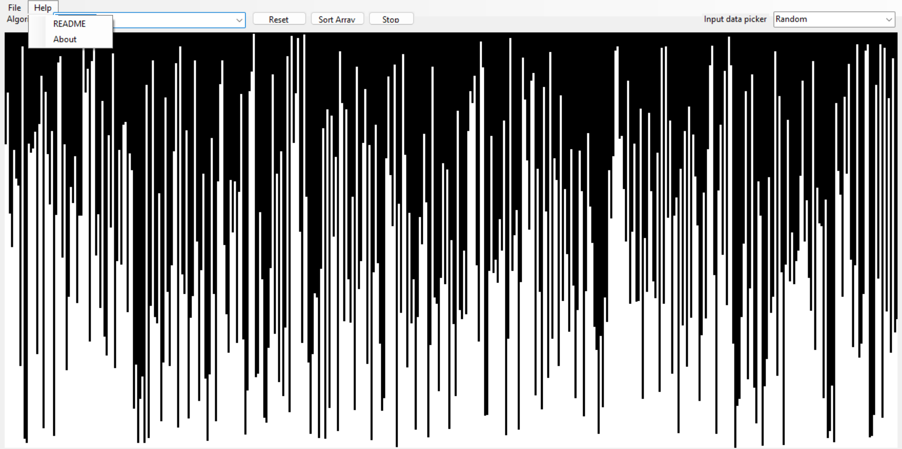

# Sort Visualizer

The **Sort Visualizer** is an application designed to visually demonstrate the operation of different sorting algorithms. This tool allows users to observe the step-by-step process of sorting, providing an educational insight into how various algorithms work.

## Key Features
- Supports multiple sorting algorithms such as Bubble sort, Counting sort, Heap sort, Insertion sort, Merge sort, Quick sort, Radix sort and Selection sort.
- Real-time visualization of the sorting process.
- Ability to stop the sorting in the process and change the sorting algorithm (except Counting sort).
- Background worker integration to keep the UI responsive during sorting.
- Custom data import

#### Disclaimer
To ensure that the sorting process can be visually observed, the sorting algorithms have been intentionally slowed down. As a result, algorithms that may generally be faster in a standard execution context could appear slower due to this deliberate delay.

## Screenshots

### Main Interface

### Help Menu

## Installation

To run the Sort Visualizer:

1. Clone or download the repository.
2. Open the solution file in Visual Studio.
3. Build the project to restore dependencies.
4. Run the application from Visual Studio.

### Requirements

- **.NET 8.0 Runtime**: Ensure that the .NET 8.0 Runtime is installed on your machine.
- **Windows OS**: A Windows operating system (preferably Windows 10 or later).

## Usage

1. Select the sorting algorithm from the algorithm dropdown menu.
2. Choose the input data type from the input data picker.
3. Click on **Sort Array** to start the visualization.
4. Use the **Stop** button to stop and **Reset** to redraw the array selected in the input data picker.
