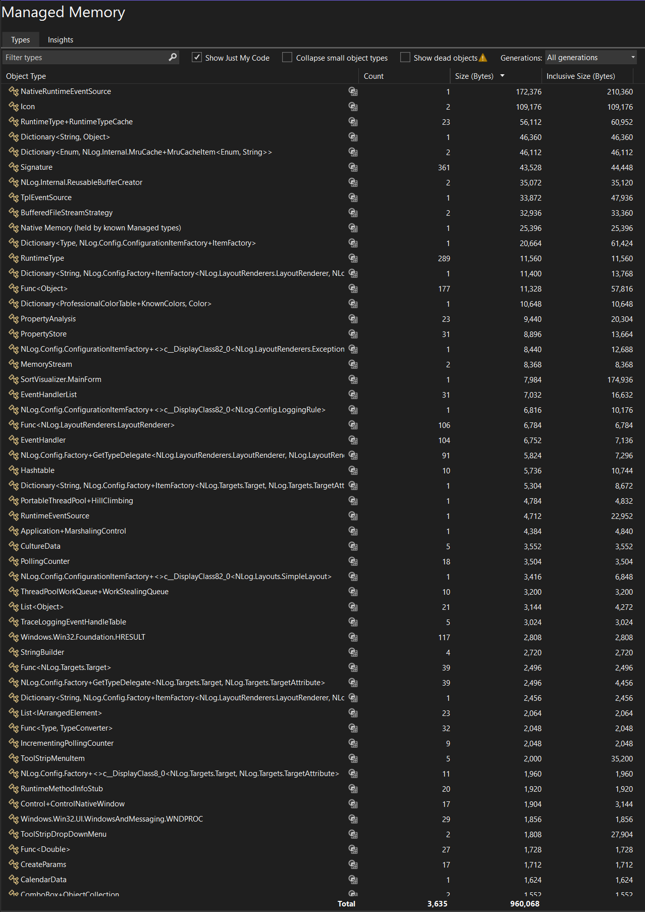

Miroslav Mauritius Toma
mauritius1232@gmail.com

Deadline: 23.4.2025

## Instructions:

The main purpose of this assignment is to get some practice with tools for logging and monitoring of program behavior.
You can write the report in Czech.
Submit everything necessary to evaluate your solution (report, program code, diff, configuration, ...) in one zip file.

## Tasks

### 1. Usage of logging frameworks.

Choose your own program of a reasonable size and complexity, written in C++, Java or C# (e.g., term project).

Implement logging into the program, using some framework (library) available for the language and platform (e.g., Log4j for Java, log4net, or syslog API). Configure the logging framework such that log messages are saved into the file "events.log". Log some important events of your choice (such as warnings and error situations). For each logged event, record also the name (ID) of the current thread, current time in seconds, and source code location (class, method), if possible. Report fatal errors also to console, in addition to the file "events.log".

Do not forget to submit a diff that shows the logging commands added to your program code, and configuration of the logging framework.

### 2. Practice with monitoring tools.

Choose some long-running program in C# or Java, for example a web server or some GUI application (text editor, game).

Use any mature runtime monitoring tool for the respective platform (VisualVM for Java, or .NET Memory Profiler) to get a report of memory usage.
In the case of VisualVM and Java, get the list of Java classes sorted by the size of memory (heap) fragments taken by all their instances together. Record the list of Java classes roughly 5 minutes after you start the program. You can provide just around top 20 classes (bit more or less is fine), depending on how many records fit on the screen of your computer.
In the case of C#/.NET, use the .NET Memory Profiler (that should be available in recent Visual Studio) to get the total amount of memory used by all instances of each individual class. Record the information (in the form of a screenshot or text file) at some point during the program execution. The profiler can be downloaded here: https://marketplace.visualstudio.com/items?itemName=SciTechSoftware.NETMemoryProfiler. \

Do not forget to submit the report of memory usage in some form (a text file or screenshot).

### 3. Measuring test coverage.

Pick some rather mature tool for measuring test coverage of projects in your preferred language (Java or C#) and use it on your own large program with unit tests, just to see how much your code is really covered by tests that you have written. Submit the report of test coverage in some form (a text file or screenshot).

---

## Task 1

**Logging framework:** For my project in C# I chose NLog.

**Setup:** I installed the NLog using NuGet package manager.

**Configuration:** I made a file called `nlog.config` as a configuration file for NLog. There I specified to log every message into the file and messages with Fatal level also to console.

```
<?xml version="1.0" encoding="utf-8" ?>
<nlog xmlns="http://www.nlog-project.org/schemas/NLog.xsd"
      xmlns:xsi="http://www.w3.org/2001/XMLSchema-instance"
      autoReload="true"
      internalLogLevel="Info"
      internalLogFile="c:\temp\internal-nlog.txt"> <!-- Optional: For NLog internal debugging -->

    <!-- Define targets -->
    <targets>
        <!-- File Target -->
        <target name="logfile" xsi:type="File"
                fileName="events.log"
                layout="${longdate:universalTime=true:format=yyyy-MM-dd HH\:mm\:ss.fff} | ${level:uppercase=true} | Thread: ${threadid} | ${callsite:className=true:methodName=true:fileName=true:includeSourcePath=false} | ${message} ${exception:format=tostring}" />

        <!-- Console Target for Fatal errors -->
        <target name="logconsole" xsi:type="Console"
                layout="${longdate:universalTime=true:format=yyyy-MM-dd HH\:mm\:ss.fff} | ${level:uppercase=true} | ${message} ${exception:format=tostring}" />
    </targets>

    <!-- Define rules -->
    <rules>
        <!-- Log all levels from Info and higher to the file -->
        <logger name="*" minlevel="Info" writeTo="logfile" />
        <!-- Log only Fatal level to the console -->
        <logger name="*" minlevel="Fatal" writeTo="logconsole" />
    </rules>
</nlog>
```

**Code changes:** I have added informative and error logging messages to the MainForm class. The changes made are in the `logging_changes.diff` file.

**Output:** After running the program from Visual Studio, the logger generated `events.log` file with some important events logged.

```
2025-04-23 20:41:04.1203 | INFO | Thread: 1 | SortVisualizer.MainForm..ctor(MainForm.cs:23) | Application starting.
2025-04-23 20:41:04.3557 | INFO | Thread: 1 | SortVisualizer.MainForm..ctor(MainForm.cs:35) | MainForm initialized successfully.
2025-04-23 20:42:10.1987 | INFO | Thread: 12 | SortVisualizer.MainForm.bgWorker_DoWork(MainForm.cs:262) | Background worker started for algorithm: MergeSort
2025-04-23 20:42:19.9440 | WARN | Thread: 1 | SortVisualizer.MainForm.bgWorker_RunWorkerCompleted(MainForm.cs:291) | Sorting operation was cancelled by the user.
2025-04-23 20:42:35.7813 | INFO | Thread: 10 | SortVisualizer.MainForm.bgWorker_DoWork(MainForm.cs:262) | Background worker started for algorithm: MergeSort
2025-04-23 20:43:20.9780 | INFO | Thread: 1 | SortVisualizer.MainForm.bgWorker_RunWorkerCompleted(MainForm.cs:305) | Sorting operation completed successfully.
2025-04-23 20:43:48.5094 | INFO | Thread: 7 | SortVisualizer.MainForm.bgWorker_DoWork(MainForm.cs:262) | Background worker started for algorithm: RadixSort
2025-04-23 20:45:40.3849 | INFO | Thread: 1 | SortVisualizer.MainForm.bgWorker_RunWorkerCompleted(MainForm.cs:305) | Sorting operation completed successfully.
2025-04-23 21:10:04.7086 | INFO | Thread: 1 | SortVisualizer.MainForm..ctor(MainForm.cs:23) | Application starting.
2025-04-23 21:10:04.9283 | INFO | Thread: 1 | SortVisualizer.MainForm..ctor(MainForm.cs:35) | MainForm initialized successfully.
2025-04-23 21:10:15.8828 | INFO | Thread: 7 | SortVisualizer.MainForm.bgWorker_DoWork(MainForm.cs:262) | Background worker started for algorithm: BubbleSort
2025-04-23 21:10:24.6110 | INFO | Thread: 1 | SortVisualizer.MainForm.bgWorker_RunWorkerCompleted(MainForm.cs:305) | Sorting operation completed successfully.
2025-04-23 21:10:28.9684 | INFO | Thread: 7 | SortVisualizer.MainForm.bgWorker_DoWork(MainForm.cs:262) | Background worker started for algorithm: BubbleSort
2025-04-23 21:10:30.1883 | WARN | Thread: 1 | SortVisualizer.MainForm.bgWorker_RunWorkerCompleted(MainForm.cs:291) | Sorting operation was cancelled by the user.
2025-04-23 21:10:54.5597 | INFO | Thread: 12 | SortVisualizer.MainForm.bgWorker_DoWork(MainForm.cs:262) | Background worker started for algorithm: CountingSort
2025-04-23 21:10:59.2384 | INFO | Thread: 1 | SortVisualizer.MainForm.bgWorker_RunWorkerCompleted(MainForm.cs:305) | Sorting operation completed successfully.
2025-04-23 21:11:11.7294 | INFO | Thread: 12 | SortVisualizer.MainForm.bgWorker_DoWork(MainForm.cs:262) | Background worker started for algorithm: InsertionSort
2025-04-23 21:11:30.6179 | WARN | Thread: 1 | SortVisualizer.MainForm.bgWorker_RunWorkerCompleted(MainForm.cs:291) | Sorting operation was cancelled by the user.
2025-04-23 21:11:39.3681 | INFO | Thread: 12 | SortVisualizer.MainForm.bgWorker_DoWork(MainForm.cs:262) | Background worker started for algorithm: MergeSort
2025-04-23 21:12:14.2657 | INFO | Thread: 1 | SortVisualizer.MainForm.bgWorker_RunWorkerCompleted(MainForm.cs:305) | Sorting operation completed successfully.
2025-04-23 21:12:23.9829 | INFO | Thread: 12 | SortVisualizer.MainForm.bgWorker_DoWork(MainForm.cs:262) | Background worker started for algorithm: SelectionSort
2025-04-23 21:12:58.8570 | INFO | Thread: 1 | SortVisualizer.MainForm.bgWorker_RunWorkerCompleted(MainForm.cs:305) | Sorting operation completed successfully.
2025-04-23 21:13:09.1399 | INFO | Thread: 12 | SortVisualizer.MainForm.bgWorker_DoWork(MainForm.cs:262) | Background worker started for algorithm: QuickSort
2025-04-23 21:13:09.1561 | INFO | Thread: 1 | SortVisualizer.MainForm.bgWorker_RunWorkerCompleted(MainForm.cs:305) | Sorting operation completed successfully.
2025-04-23 21:13:15.4343 | INFO | Thread: 19 | SortVisualizer.MainForm.bgWorker_DoWork(MainForm.cs:262) | Background worker started for algorithm: QuickSort
2025-04-23 21:15:35.7426 | INFO | Thread: 1 | SortVisualizer.MainForm.bgWorker_RunWorkerCompleted(MainForm.cs:305) | Sorting operation completed successfully.
```

---

## Task 2

**Monitoring tool used:** For this task I have used Visual Studio's built-in Diagnostic Tools (Memory Usage tool).

**Monitoring phase:** I started the application and ran few sorting algorithms on some test data and random data, after approximately 5 minutes I took a snapshot of memory usage in Visual Studio.


---

## Task 3

**Coverage Tool Choice:** Since Visual Studio's built-in code coverage requires the Enterprise edition, I chose Coverlet as the tool.

**Steps & Explanation:**

**Challenge:** This project contains unit tests (`SortEngineTests.cs`) directly within the main WinForms application project (`SortVisualizer.csproj`) instead of a separate standard test project.

**Attempt 1:** I installed the `coverlet.collector` NuGet package into the `SortVisualizer` project. Running `dotnet test --collect:"XPlat Code Coverage"` in the solution directory failed to find the data collector.

**Attempt 2:** I edited the `SortVisualizer.csproj` file manually to ensure `Microsoft.NET.Test.Sdk`, `MSTest.TestAdapter`, `MSTest.TestFramework`, and `coverlet.collector` packages were referenced, attempting to enable test execution within the main project.

**Result:** Running `dotnet test SortVisualizer.csproj --collect:"XPlat Code Coverage"` still resulted in the error "Unable to find a datacollector with friendly name 'XPlat Code Coverage'". This indicates that the `dotnet test` tooling cannot reliably run tests and attach the coverage collector to a project with an output type of `WinExe`.
